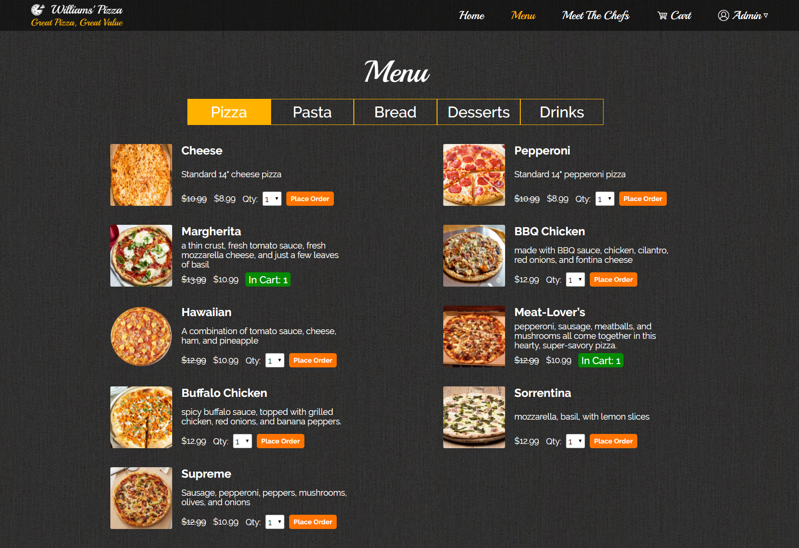
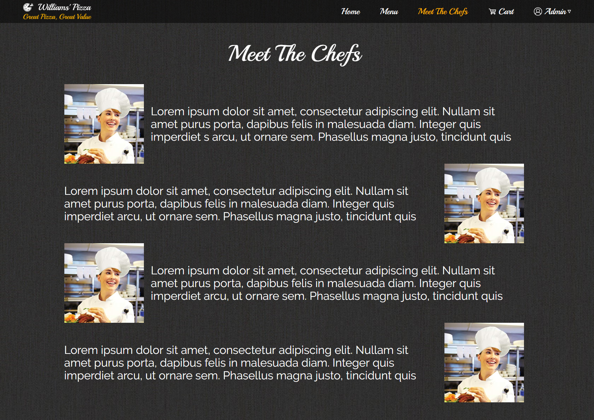
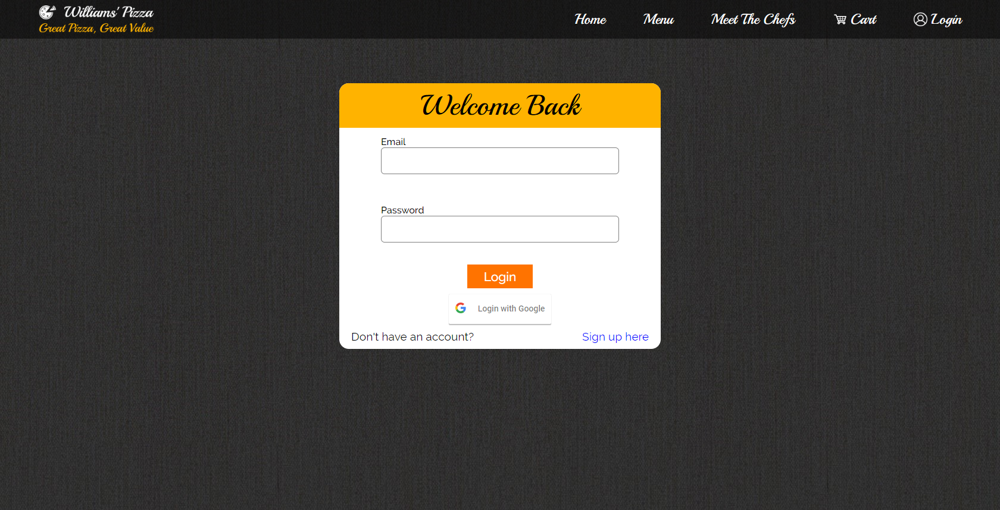
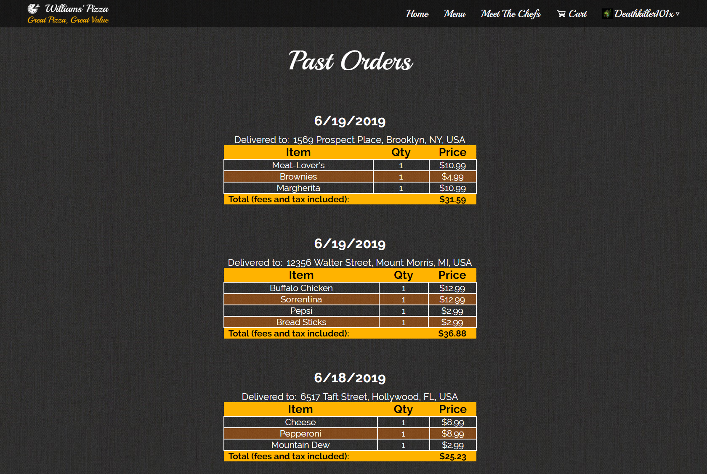
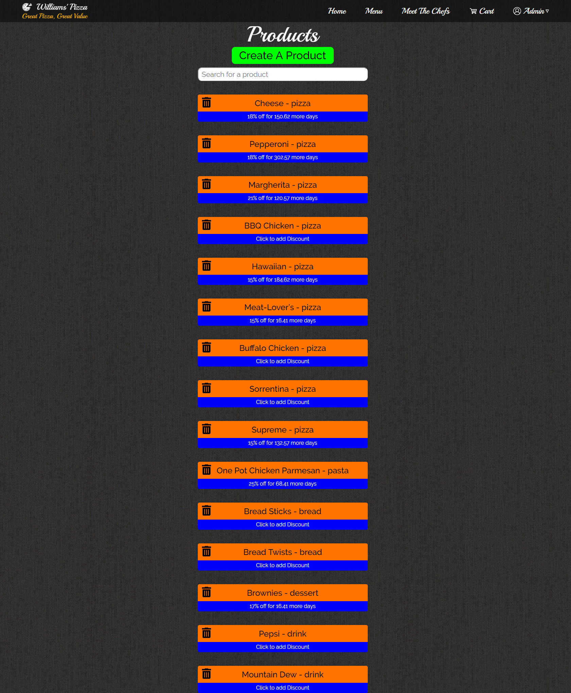

# Williams' Pizza

## Description

> This is a pizzeria website which can take orders from customers. It implements a RESTful API on the backend which allows the owner to create, delete, or edit any product or discount at any time. It also makes use of Google Places and Maps API for easier address finding.

## Timeline

> April 15, 2019 - June 19, 2019

## Technology

> * React.js
>   * react-router
>   * react-redux
> * Node.js
> * Express.js
>   * bcrypt
>   * JWT
>   * google-auth-library
> * MongoDB
>   * mongoose

## What I learned

> * Learned how to hash password for better security
> * Multi-step forms
> * Database Indexes
> * Browser Compatibility
> * 4k Support
> * Learned how to work will google related APIs
> * Review Slideshows
> * Image Compression
> * Learn how to audit a page with lighthouse
> * Learned how to create cookies
> * Learned how to create shapes with just CSS
> * JWT for session-less authentication
> * Functional Components

## How to install

> To view or edit this project, follow these instructions
>
> ``` terminal
> git clone https://github.com/williamj1788/Williams-Pizza
> cd Williams-Pizza
> npm install && npm install --prefix client
> npm run dev
> ```
>
> The project should open up in a new tab
>
> If it doesn't, you can view it on localhost 3000
>
> API Keys are either not include or have change for security reasons. Some features may not work correctly.

## Pages

> You can view this site [here](https://williamspizza.herokuapp.com/)

### Home


### Menu



### Chefs



### Login



### History



### Products

